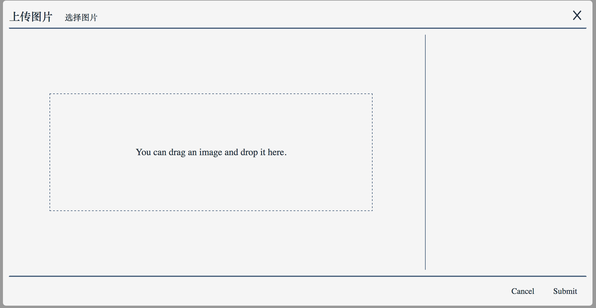

# embellish-image
A plugin that can upload local image, crop image, embellish image and save image to server or local. 

Developing ... 2017-05-26 12:44:04


## Installation
You can install this package either with ```npm``` or with ```yarn```.

**Yarn**
```
yarn install embellish-image
```
**HTML**
```html
<link rel="stylesheet" href="src/scss/embellish-image.scss">

<a id="upload" class="style">Upload Image</a>

<a id="save">Submit</a>
```
**JavaScript**
```js
import EmbellishImage from 'embellish-image';

const config = {
  width: 400,
  height: 300,
  serverURL: 'server url here.'
};

const dom = document.getElementById('upload');

// init
const embellishImage = new EmbellishImage(dom, config);

// <!--save-->
document.getElementById('save').onclick(function() {

  embellishImage.save();
})
```

## Plan
 
- [x] upload image
- [ ] save image to server
- [ ] embellish image (canvas)
- [x] enable drag and drop
- [ ] enable responsive
- [ ] support take a picture as upload